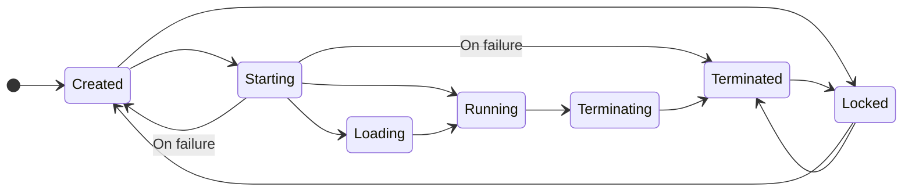

Kameleo profiles are reusable containers that bundle a full browser fingerprint (hardware, network, environment traits) together with persistent state like cookies, history, storage, passwords, and bookmarks plus user customizations (proxy, extensions, switches). Each profile is tied to a specific kernel (browser engine/version) and can be started, stopped, exported/imported, and safely shared via locking when stored in the cloud. They let every session appear as a distinct consistent device that you can pause and later resume without losing context.

## Components of a profile

| Category               | Examples                                                      |
| ---------------------- | ------------------------------------------------------------- |
| Fingerprint attributes | UA, screen, WebGL, device memory, languages                   |
| Persistent state       | Cookies, local/session storage, IndexedDB, cache              |
| User customizations    | Proxy config, extensions, language override, command switches |
| Kernel binding         | Chroma or Junglefox version mapping                           |
| Metadata               | Name, tags, storage location (local/cloud), creation time     |

## Lifecycle

Virtual browser profiles can be in one of several lifetime states, each reflecting the status of the associated browser kernel and defining which actions can be performed:

- **Created**: The profile is created, but the browser kernel has not started.
- **Starting**: The browser kernel is in the process of starting.
- **Running**: The browser kernel is active and operational.
- **Terminating**: The browser kernel is shutting down.
- **Terminated**: The browser kernel is not running but was previously started.
- **Locked**: The profile is currently in use by another user on your team.
- **Loading**: The profile data or browser kernel is syncing with cloud storage.

## Local vs cloud storage

Kameleo supports both local and cloud-based profiles to meet different workflow needs.

**Local profiles** are stored directly on your device in Kameleo's workspace folder. They are faster to launch and manage, as all data is accessed and saved locally, so it is ideal for individual users or scenarios where performance is critical.

**Cloud profiles** are stored and synced via Kameleo's secure cloud infrastructure. Changes and updates to a cloud profile are instantly accessible to all team members, which makes collaboration seamless across multiple devices or users.

## Cleanup strategy

- Periodically delete unused Terminated profiles to free disk space
- Export before risky experiments
- Tag profiles for audit & grouping (roadmap dependent)
