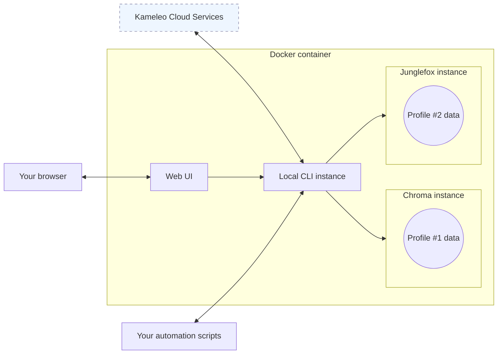

This guide shows you how to run Kameleo inside a Docker container and expose the Local API on your host. Use the containerized deployment when you need an isolated, reproducible environment — for example, in CI pipelines, ephemeral workers, or remote hosts.

The [`kameleo/kameleo-app:latest`](https://hub.docker.com/r/kameleo/kameleo-app) image is a multi-platform manifest covering both Windows (Server Core LTSC 2022) and Linux (Ubuntu 22.04). Docker automatically pulls the variant that matches your host OS, no separate tags are needed.

## Prerequisites

+++ Linux-based container

- A Linux host (amd64), **or** Docker Desktop on Windows/macOS running in Linux containers mode (the default)
- Basic Docker experience (running containers, mounting volumes, using compose files)
- Valid Kameleo personal access token (PAT) — see [Configure](../01-getting-started/03-configure.md) to generate one

!!!warning Shared memory size
Always start the Linux container with `--shm-size=2g`. The default `/dev/shm` size of 64 MB is too small and will cause browser crashes.
!!!

+++ Windows-based container

- Docker compatible [Windows host OS](https://learn.microsoft.com/en-us/virtualization/windowscontainers/deploy-containers/version-compatibility)
- Basic Docker experience (running containers, mounting volumes, using compose files)
- Valid Kameleo personal access token (PAT) — see [Configure](../01-getting-started/03-configure.md) to generate one

!!!warning Host OS compatibility
The Windows variant is built from the _Windows Server Core LTSC 2022_ base image. You must run it on a host that supports Windows containers: Windows 11, Windows Server 2022, or Windows Server 2025.
!!!

+++

## Architecture



## Container layout & persistence

Kameleo runs under a non-administrative user inside the image. This improves isolation and reduces the surface for privilege escalation.

| Property           | Linux                          | Windows                               |
| ------------------ | ------------------------------ | ------------------------------------- |
| **Runtime user**   | `appuser` (UID 1001, non-root) | `ContainerUser` (built-in, non-admin) |
| **Data directory** | `/data`                        | `C:\data`                             |

Mount the data directory as a named Docker volume to persist state (profiles, kernels) across container recreations.

!!!tip Use named volumes, not bind mounts
Always use a named volume (e.g. `-v kameleo-data:/data`) rather than a host bind mount (e.g. `-v ~/kameleo-data:/data`). The container runs as a non-root user (UID 1001 on Linux) and will be denied access to a host directory owned by a different user, causing an immediate startup failure.

If you don't mount the volume at all, every new container starts empty. Kameleo has to download all kernels again, which is slower and uses more bandwidth. Kernel downloads are rate limited, so starting many containers without a mounted volume can hit the limit and make startup fail.
!!!

## Configuration methods

You can configure Kameleo inside the container using the same precedence described in [Configure](../01-getting-started/03-configure.md). In container workflows you typically rely on environment variables or command-line flags appended to `docker run`.

Accepted environment variable names mirror the Engine keys with uppercase; see the full list and defaults in [Configuration options](../05-reference/06-configuration-options.md).

Mandatory credential must always be provided; without it the app will not authenticate and container startup will fail.

## Steps

### 1. Run the container

Expose port 5050, pass the PAT, and mount the named volume for persistent data:

+++ Linux-based container

```bash
docker run --platform linux/amd64 \
    --shm-size=2g \
    -p 5050:5050 \
    -e PAT="your-pat" \
    -v kameleo-data:/data \
    kameleo/kameleo-app:latest
```

+++ Windows-based container

```powershell
docker pull kameleo/kameleo-app:latest
docker run --name kameleo-app -p 5050:5050 -e PAT="your-pat" -v kameleo-data:C:\data kameleo/kameleo-app:latest
```

+++

### 2. Verify the service

Open in a browser on the host and expect the Swagger UI to load:

```text
http://localhost:5050/swagger
```

### 3. Start your first profile

The container exposes the same Local API as the desktop app. Follow the [Quickstart guide](../01-getting-started/02-quickstart.md) to install an SDK, create a client pointed at `http://localhost:5050`, and start your first automated profile.

## Example with docker-compose

Use `docker-compose.yml` for repeatable infrastructure or CI pipelines:

+++ Linux-based container

```yaml
services:
    kameleo-app:
        image: "kameleo/kameleo-app:latest"
        platform: linux/amd64
        ports:
            - "5050:5050"
        environment:
            PAT: your-pat
        volumes:
            - "kameleo-data:/data"
        shm_size: 2g
        restart: unless-stopped
volumes:
    kameleo-data:
```

+++ Windows-based container

```yaml
services:
    kameleo-app:
        image: "kameleo/kameleo-app:latest"
        ports:
            - "5050:5050"
        environment:
            PAT: your-pat
        volumes:
            - 'kameleo-data:C:\data'
        restart: unless-stopped
volumes:
    kameleo-data:
```

+++

## Health checks

The published image already defines a `HEALTHCHECK` that periodically queries the `/general/healthcheck` endpoint and marks the container as `healthy` once Kameleo is responsive. Nothing extra is required; the health status is visible via the `State` column:

```bash
docker ps
```

If you build a custom derivative image (e.g., adding tools) and replace the base `CMD`, ensure you keep or re-add a healthcheck so orchestrators wait for readiness.

## Web UI (only in Linux-based container)

The Linux container includes the Kameleo GUI, a browser-based interface served on port **80**. Expose that port to open it on your host:

```bash
docker run --platform linux/amd64 \
    --shm-size=2g \
    -p 5050:5050 \
    -p 80:80 \
    -e PAT="your-pat" \
    -v kameleo-data:/data \
    kameleo/kameleo-app:latest
```

Then open the GUI in your browser:

```text
http://localhost:80
```

!!!warning Limited functionality in Docker
The GUI served from a container has reduced functionality compared to the desktop application. Features that depend on direct filesystem access are not available or behave differently. Use the GUI for basic profile management and monitoring. For automation, use the [SDK](../05-reference/03-api-reference.md) directly.
!!!

## VNC viewer (only in Linux-based container)

The Kameleo GUI in the Linux container ships a built-in browser-based VNC viewer that lets you watch or interact with the virtual display where browsers run. It is accessible in any modern browser — no additional software is required.

The VNC server is disabled by default to keep resource utilization low. The VNC server starts automatically when opened from the GUI, or you can make it start by setting the VNCENABLE and VNCPASSWORD environment variables. This is necessary if you prefer a native VNC client (for example, RealVNC Viewer or TigerVNC), and you also need to expose port **5900** that carries the raw RFB protocol:

```bash
docker run --platform linux/amd64 \
    --shm-size=2g \
    -p 5050:5050 \
    -p 5900:5900 \
    -e PAT="your-pat" \
    -e VNCENABLE="1" \
    -e VNCPASSWORD="your-vnc-password" \
    -v kameleo-data:/data \
    kameleo/kameleo-app:latest
```

!!!warning Expose VNC only on trusted networks
Port 5900 gives full control of the virtual display. Do not expose it on a public interface without a network-level access control layer such as a reverse proxy with authentication.
!!!

## AWS ECS Support

Kameleo Docker containers are compatible with **AWS ECS (Elastic Container Service)**. The supported capacity provider depends on the platform:

| Platform | Capacity provider | Notes                                                    |
| -------- | ----------------- | -------------------------------------------------------- |
| Windows  | EC2               | Fargate does not support Windows containers with volumes |
| Linux    | EC2 or Fargate    | Fargate fully supports Linux containers                  |

When deploying to AWS ECS:

- For Windows, use EC2 capacity providers with Windows Server 2022-compatible instances.
- For Linux, EC2 and Fargate both work; Fargate is recommended for simpler infrastructure management.
- Configure appropriate instance types with sufficient resources for your Kameleo workload.
- Mount persistent storage using named volumes to preserve profile data across container restarts.

## GPU support on Linux

By default Kameleo uses software rendering inside the Linux container. If you mount the host GPU into the container, Kameleo automatically detects it and enables hardware-accelerated rendering in the browser. This can improve performance on GPU-intensive pages such as WebGL or canvas-heavy sites.

### Intel / AMD

Pass the DRI device directory and add the host device group IDs so the container user can access them:

```bash
docker run --platform linux/amd64 \
    --shm-size=2g \
    --device /dev/dri \
    --group-add $(stat -c '%g' /dev/dri/card0) \
    --group-add $(stat -c '%g' /dev/dri/renderD128) \
    -p 5050:5050 \
    -e PAT="your-pat" \
    -v kameleo-data:/data \
    kameleo/kameleo-app:latest
```

### NVIDIA

Install the [NVIDIA Container Toolkit](https://docs.nvidia.com/datacenter/cloud-native/container-toolkit/latest/install-guide.html) on the host, then pass `--gpus all`:

```bash
docker run --platform linux/amd64 \
    --shm-size=2g \
    --gpus all \
    -p 5050:5050 \
    -e PAT="your-pat" \
    -v kameleo-data:/data \
    kameleo/kameleo-app:latest
```

!!!info No GPU? No problem
When no GPU device is mounted, the container falls back to software rendering automatically. No configuration change is needed.
!!!

## Troubleshooting

### Container exits immediately

Check the container logs first:

```bash
docker logs <container-name>
```

**Authentication error** (`PAT_INVALID`, exit code 111): the PAT is wrong or expired. Verify the `PAT` environment variable.

**Permission denied on `/data`** (`Access to the path '/data/...' is denied`): you are using a host bind mount instead of a named volume. Replace `-v ~/kameleo-data:/data` with `-v kameleo-data:/data`. The container runs as a non-root user and cannot write to a host directory owned by a different user.

### Service is not responding

Manually query the health endpoint to confirm whether the Engine started successfully:

```bash
curl http://localhost:5050/general/healthcheck
```

If the request times out, the container may still be starting up. Kernel downloads run on first launch and can take several minutes depending on your connection.

### Browser crashes on Linux

If browsers fail to open or crash immediately, the container is likely missing the `--shm-size=2g` flag. The default shared memory size of 64 MB is insufficient for browsers. Restart the container with `--shm-size=2g`.

### Kernel download fails or hits rate limit

Kernel downloads are rate limited. If you start many containers simultaneously without a mounted volume, each container downloads its own copy of all kernels and can exhaust the allowed download rate. Always mount the data directory so kernels are downloaded once and reused.
