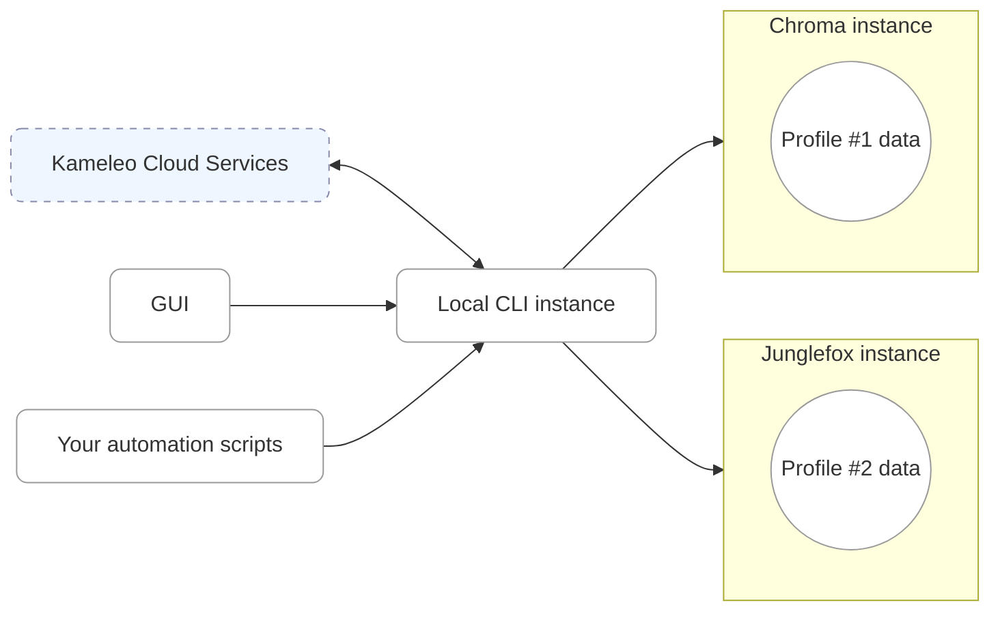

Kameleo is composed of cooperating components running both locally (on your machine) and in the cloud. Understanding their responsibilities helps when automating flows, diagnosing issues, or scaling usage across teams.

## High-level diagram

## Core components

**Kameleo CLI (local)**  
The central orchestrator that runs on your computer. It exposes a local REST API (default: `http://localhost:5050`) used by the Desktop GUI, your automation scripts (SDKs / HTTP calls), and other tools. All functional operations you perform - creating profiles, launching browsers, exporting cookies, shutting down sessions - are executed by this process.

**GUI (Desktop UI)**  
Primarily a rich client atop the local API, but with added convenience and productivity features.

**Automation scripts (SDKs & custom code)**  
Your scripts (C#, TypeScript/JavaScript, Python, etc.) talk directly to the local API or via official SDKs. They perform the same actions the GUI does, enabling CI/CD and large‑scale orchestration.

**Cloud services**  
Kameleo cloud-side infrastructure provides authentication, subscription & team management, fingerprint generation, and other remote capabilities the CLI depends on. The CLI maintains secure sessions with these services as needed.

**Profile data (virtual browsers)**  
Each running browser instance (e.g., Chroma, Junglefox) is tied to a virtual browser profile storing fingerprint parameters, storage (cookies, localStorage), stateful artifacts, and session history. The CLI persists and updates these as you operate the profile.
