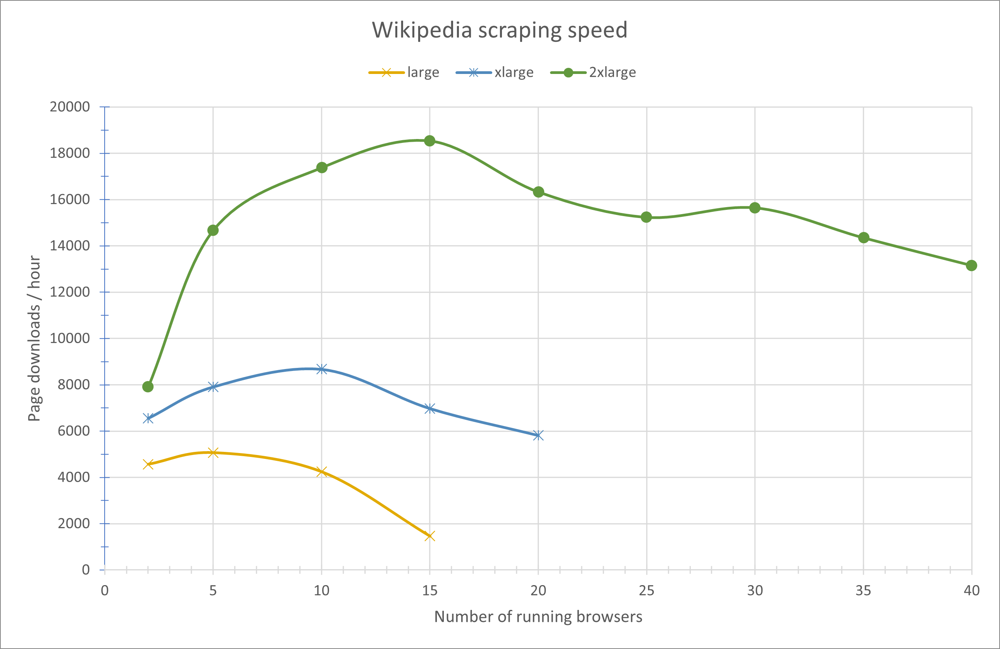
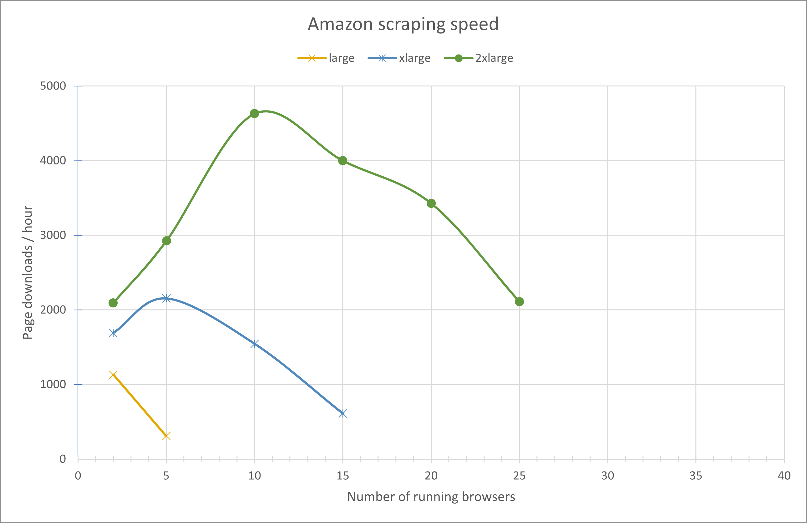
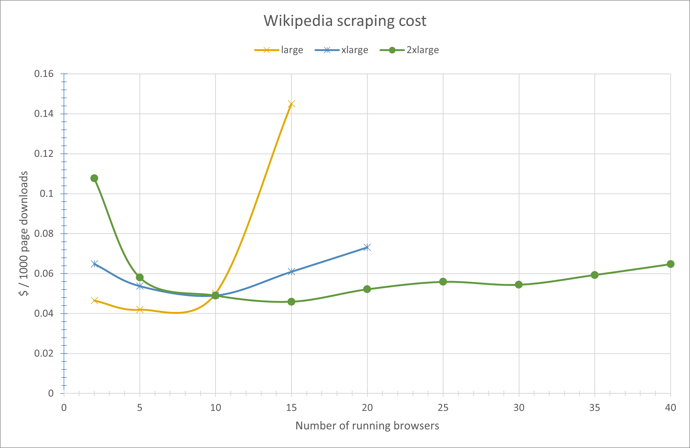
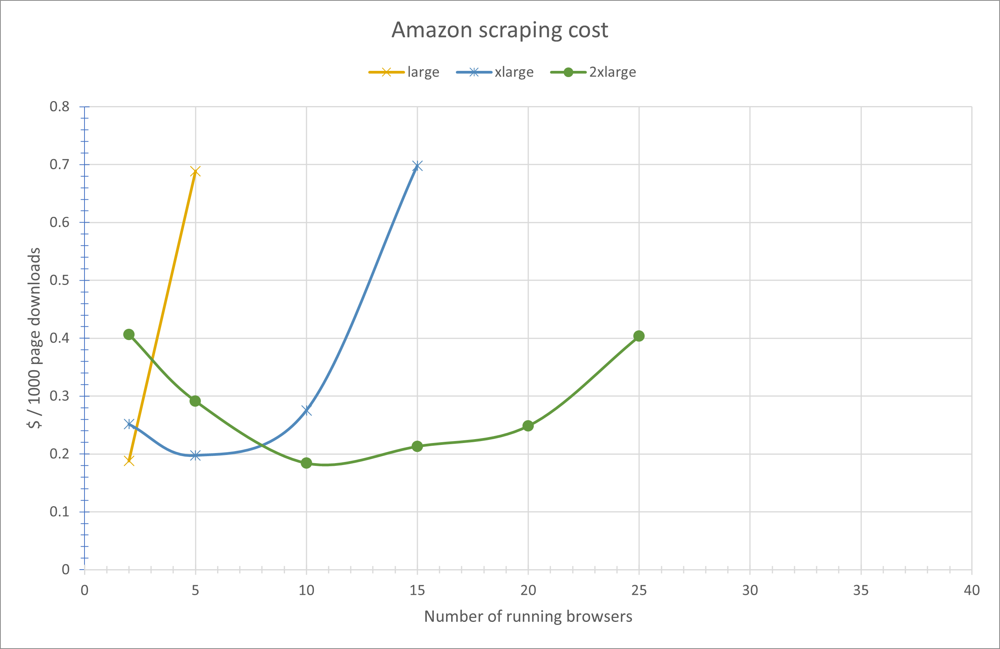

# Performance benchmark

This benchmark helps you estimate the expected performance of Kameleo-based scraping setups and choose the most suitable server type for your workload. By comparing throughput and cost efficiency across different EC2 instances, you can make data-driven decisions about scaling, concurrency tuning and infrastructure budgeting.

## Scope

Compares `m7i.large`, `m7i.xlarge`, and `m7i.2xlarge` instance types using two workloads (Wikipedia archival pages and Amazon product detail pages). Each workload: (1) discover target URLs from a seed page; (2) fetch each page sequentially and persist to disk. Metrics exclude seed pages.

## Test environment

All instances: Intel Xeon Platinum 8488C, DDR5 memory, Chroma browser build 141.

### Instance specifications

| Instance    | vCPU | RAM (GiB) | Hourly price (USD) |
| ----------- | ---- | --------- | ------------------ |
| m7i.large   | 2    | 8         | 0.21275            |
| m7i.xlarge  | 4    | 16        | 0.4255             |
| m7i.2xlarge | 8    | 32        | 0.851              |

### Concurrency levels

Profile counts tested: 2, 5, 10, 15, 20, 25, 30, 35, 40. All profiles were instrumented by the same script but each profile acted as an independent sequential scraper, there was no inter‑profile communication.

## Workloads

### Wikipedia archival pages

Seed index enumerates yearly subpages. Measurement starts at initial navigation (including enumeration) and ends when the final subpage is saved. Only subpages count toward throughput.

### Amazon product detail pages

Listing page yields product detail URLs. Each product page is fetched and saved sequentially. Only successful product detail pages count toward throughput.

## Results

Graphs (time vs workers and cost vs workers) are provided for both workloads and all instance sizes.

### Throughput (time)

#### Wikipedia throughput

Low concurrency (2 running profiles) shows minimal difference between instance sizes (resource underutilization). Throughput improves with additional profiles until saturation; m7i.2xlarge sustains higher mid‑range concurrency before slowdown. Beyond optimal profile count latency increases and error rate rises (e.g., timeouts) decreasing effective throughput.

#### Amazon throughput

Similar early scaling. Benefits of larger instances appear sooner due to heavier pages. Throughput declines at lower worker counts than Wikipedia because dynamic content increases CPU and memory pressure.

### Cost efficiency

Cost per useful page depends on both hourly instance price and completion time.

#### Wikipedia cost

Underutilization at low profile counts favors smaller instances. Excessive concurrency on smaller instances degrades performance enough that their cost per page exceeds larger instances. Around ~10 running profiles cost efficiency converges across sizes.

#### Amazon cost

Heavier workload increases contention; smaller instances show sharper cost per page increase as profile count grows. Largest instance maintains more stable efficiency at higher concurrency.

## Key takeaways

| Instance    | Effective concurrency band | Notes                                                     |
| ----------- | -------------------------- | --------------------------------------------------------- |
| m7i.large   | 2–5 profiles               | Early CPU saturation; suitable for light loads.           |
| m7i.xlarge  | 5–10 profiles              | Handles medium concurrency without disproportionate cost. |
| m7i.2xlarge | ≥15 profiles               | Maintains throughput where smaller sizes degrade.         |

General: Larger instances defer saturation enabling more concurrent browsers before resource contention reduces throughput.

## Interpretation notes

- Results reflect sequential page processing per running profile; different orchestration (e.g., parallel fetch within profiles) would change scaling characteristics.
- Network variability, target site rate limits, and transient page dynamics can introduce run‑to‑run variance; reported behavior is representative not absolute.
- Optimal profile count should balance throughput with error rate; exceeding saturation increases timeouts and reduces effective pages saved.
